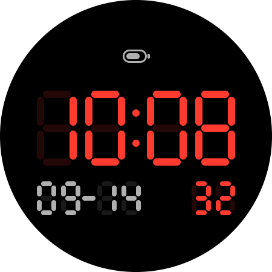

# Seven Segment watch face

A 7-segment LCD-style watch face for Wear OS, built with [Watch Face Format](https://developer.android.com/training/wearables/wff) (WFF v4, Wear OS 6+). WFF is the only watch face type the latest Wear OS on Pixel Watch accepts. The APK has no code, only resources.



## Features
- `HH:MM` time drawn with native clock text and generated seven-segment glyphs. Follows the watch's 12/24-hour setting; both modes retain the leading zero for display-offload compatibility.
- `MM-DD` date in smaller segments.
- LCD-style battery meter above the time: a battery outlined in segments with five charge bars (red when low), and the level in small 7-segment digits with a segment `%`.
- Editable in the watch face editor (long-press the watch face → **Customize**):
  - **Time color**: 11 presets.
  - **Date color**: the same presets. It also colors the battery indicator.
  - **Unlit segments**: the faint "ghost 8" behind the lit segments.
  - **Shortcut**: a complication slot below the date, empty by default. Set it to **Gemini** (or any app shortcut) and tap it to launch. Monochrome icons follow the date color.
- In always-on mode, ghost segments and the shortcut are hidden and date/battery graphics are dimmed. The time stays opaque; the watch lowers display brightness.

## Layout
`tools/generate_watchface.py` is the source of truth. It writes these files:

| File                                                   | Contents                  |
|--------------------------------------------------------|---------------------------|
| `app/src/main/res/drawable-nodpi/seg_time_*.png`        | native clock bitmap glyphs |
| `app/src/main/res/raw/watchface.xml`                   | the WFF scene             |
| `app/src/main/res/values/strings.xml`                  | editor labels             |
| `app/src/main/res/drawable-nodpi/preview.png`          | watch face picker preview |
| `app/src/main/res/drawable/ic_launcher_foreground.xml` | app icon artwork          |
| `app/src/main/res/mipmap-anydpi/ic_launcher.xml`       | adaptive app icon         |

Don't edit those files by hand. Change the geometry, palette, or options in the script, then regenerate:

```bash
python tools/generate_watchface.py
```

## Build

```bash
./gradlew :app:assembleDebug
```

For Play Store uploads, build `bundleRelease` with your signing config. R8 is enabled for release, so the output contains no dex.

## Install
With the watch (or a Wear OS emulator) connected over ADB, for example through **Settings → Developer options → Wireless debugging** on the watch:

```bash
adb install -r app/build/outputs/apk/debug/app-debug.apk
```

Then long-press the current watch face, scroll to **Seven Segment**, and select it.

## Ambient updates and Pixel Watch diagnostics

The time uses two `DigitalClock` / `TimeText` components (`hh` and `mm`),
not hour/minute-dependent `Condition` elements. Preserve the native clock
structure when changing its appearance. The bitmap glyphs reproduce the same
pill geometry and spacing; `keep.xml` retains them in release builds.

Testing on Pixel Watch 5, Android 17 build `CP3A.260905.002`, with DWF renderer
`5.0.03 (50003)` exposed these display-offload rejection messages:

- Conditional time shapes: `[NOT_OFFLOADABLE] Node has a timeDataSource`.
- Ambient alpha on the clock's parent: `Clock is not opaque`.
- Unpadded `h` format: `DigitalClock has Non leading zero time text`.
- Three clock components: `Too many clock components analog: 0 digital: 3`.

The current two-component opaque clock passes those checks. This watch's system
then reports `sendWatchFaceLayout not supported`, however, so passing the layout
checks does **not** prove that hardware clock offloading is active. The original
face used a `BRIGHTNESS_ONLY` session in `DOZE_SUSPEND`; this candidate instead
remains in `DOZE` and can receive ambient minute redraws. Device logs recorded consecutive ambient redraws at 17:44:00 and 17:45:00
on 2026-09-14 without an intervening wake, and the wearer confirmed that the
time advanced while the display stayed dim. This verifies an ambient-update
workaround, not hardware clock offloading. Battery impact remains unmeasured.

Android's [TimeText reference](https://developer.android.com/reference/wear-os/wff/clock/time-text)
describes the native clock formats. These additional restrictions are observations
from the installed renderer, not general XML validation rules.

Run the generator regression checks and Android checks with:

```bash
python -m unittest discover -s tools -p "test_*.py"
./gradlew :app:assembleDebug :app:assembleRelease :app:lintDebug
```

For a physical test, leave the watch worn, still, and dim for at least three minute
boundaries. Check the time without raising the wrist. Repeat after waking it.
ADB screenshots alone cannot prove that an offloaded physical display updated.
Useful diagnostics:

```bash
adb logcat -d
adb shell dumpsys DisplayOffloadService
adb shell dumpsys activity service com.google.wear.watchface.runtime/.DeclarativeWatchFaceRuntime0
```
